# PaperTradingPM

A paper trading platform for [Polymarket](https://polymarket.com) prediction markets. Browse real markets, execute simulated trades, and track portfolio performance—all without risking real money.

*Why Paper Trading?*

1) Practice without risk : test your prediction skills and trading strategies before committing real funds
2) Legal compliance : Prediction market betting is restricted or prohibited in many jurisdictions. Paper trading lets you participate in the experience without legal concerns
3) Learning tool : Understand how prediction markets work and how prices move with real market data

---

## System Overview

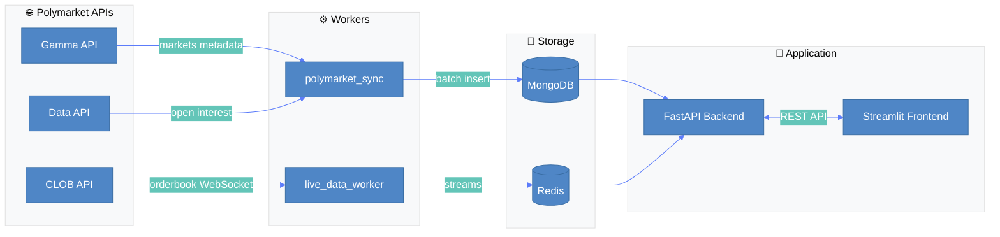

| Service | Port | Role |
|---------|------|------|
| Frontend (Streamlit) | 8501 | User interface |
| Backend (FastAPI) | 8000 | REST API + WebSocket |
| MongoDB | 27017 | Persistent storage |
| Redis | 6379 | Live data cache |
| polymarket-sync | — | Market metadata sync worker |
| live-data-worker | — | Orderbook streaming worker |

## Project Structure

```
PaperTradingPM/
├── backend/app/
│   ├── main.py              # App entry, CORS, router mounting
│   ├── config.py            # Pydantic settings from environment
│   ├── core/                # Security (JWT, bcrypt), rate limiting
│   ├── database/            # MongoDB connections, multi-DB registry
│   ├── models/              # Pydantic models for MongoDB documents
│   ├── schemas/             # Request/response validation schemas
│   ├── services/            # Business logic (auth, markets, portfolios)
│   ├── routers/             # API endpoint definitions
│   └── dependencies/        # FastAPI dependency injection (auth, roles)
├── frontend/
│   ├── main.py              # Streamlit app entry
│   ├── views/               # Page components (trading, portfolio, etc.)
│   └── utils/               # API client, formatters, styles
├── workers/
│   ├── polymarket_sync/     # Periodic market metadata fetcher
│   └── live_data_worker/    # Real-time orderbook to Redis
├── tests/                   # See tests/TESTING.md
└── docker-compose.yml
```

---

## 1. Running the Application

> **Note**: These instructions are for **local development** only. The codebase is designed with deployment in mind, but additional configuration is required for production (see [Section 4](#4-implementation-notes--deployment-todos)).

### Prerequisites

- Docker and Docker Compose (v2+)
- Git
- MongoDB Compass (optional, for database inspection)

### Step-by-Step Setup

**1. Clone the repository**

```bash
git clone <repository-url>
cd PaperTradingPM
```

**2. Create environment file**

Create a `.env` file in the project root:

```env
MONGO_URI=mongodb://mongodb:27017
REDIS_HOST=redis
REDIS_PORT=6379
API_KEY = "POLYMARKET_CLOB_API_KEY"
CLOB_URL=https://clob.polymarket.com
JWT_SECRET_KEY=CHANGE_ME_IN_PRODUCTION_USE_STRONG_SECRET
```

API_KEY should be replaced by one's own polymarket CLOB api key
Specific to the course : we have provided an API_KEY for you to test the app, see in .env.example. 
We are fully aware that api keys and .env should never be commited, the key corresponds to a throwaway account with no wallet associated, so really there shouldn't be any meaningful risk. We chose this solution for your convenience when grading. The credentials will be revoked once the grading for our project is complete.

**3. Build the containers**

```bash
docker compose build
```

**4. Start all services**

```bash
docker compose up
```

**5. Wait for initial data sync**

On first run, the `polymarket_sync` worker fetches all Polymarket markets. This takes approximately **5 minutes** depending on your connection. Watch the logs associated to this service for progress.

**6. Verify the setup**

| Service | URL | Expected |
|---------|-----|----------|
| Health check | http://localhost:8000/health | `{"status": "healthy"}` |
| API docs (Swagger) | http://localhost:8000/docs | Interactive API documentation |
| Frontend | http://localhost:8501 | Streamlit interface |
| MongoDB | mongodb://localhost:27017 | 4 databases: `auth_db`, `trading_db`, `markets_db`, `system_db` |

### Running Tests

Tests run in a dedicated Docker service. See [tests/TESTING.md](tests/TESTING.md) for full documentation.

```bash
# Run all unit tests
docker compose run --rm test /tests -m "not integration" -v

# Run with coverage
docker compose run --rm test /tests --cov=app --cov-report=term-missing
```

---

## 2. How to Use the App

This section explains how to navigate and use the Streamlit interface step by step.

---

### 2.1. Login and Account Creation

- **Login Page**: When opening the application, you arrive on the Login page.  
  - Enter your **email address** and **password**.  
  - If you don’t have an account yet, click the **Register** button to set up your account.  
  - Once your account is created, log in with your credentials.  


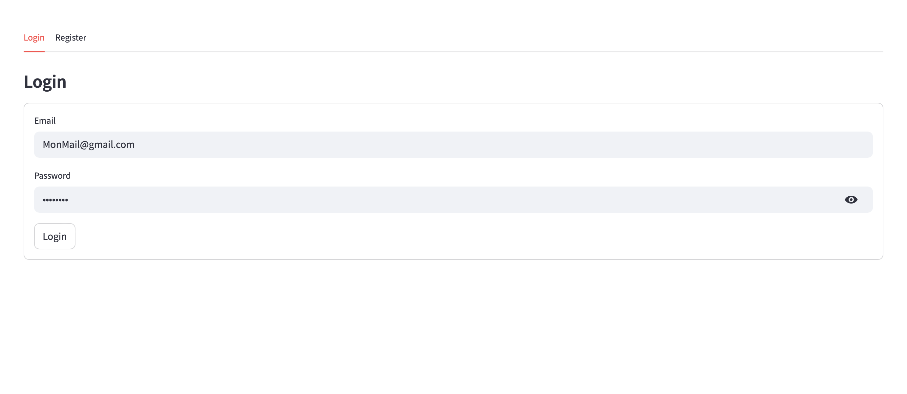


---

### 2.2. Main Navigation

After logging in, the application offers **five main pages** accessible via the side menu:  

1. **Trading**: Explore and trade on available markets.  
2. **Portfolio**: Create and manage your portfolios, check positions and balances.  
3. **History**: View the history of all your transactions.  
4. **Account**: Update personal information and log out.  
5. **Metrics**: Visualize statistics and metrics on your performance and market activity.  

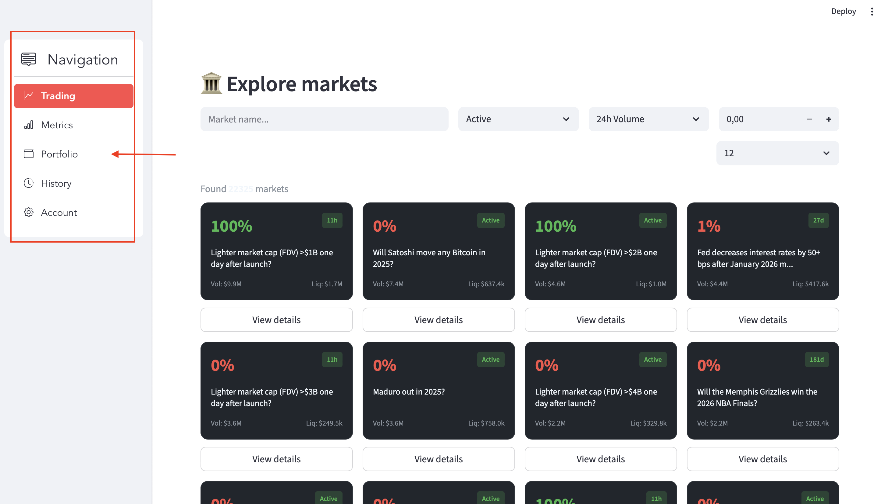

---

### 2.3. Trading Page

The Trading Page is where you can explore different Polymarket markets and take positions by clicking 'View Details' to place an order and access more information about the selected market.

- **Explore Markets**:  
  - Browse the list of Polymarket markets.  
  - Filter by **active / closed** status or sort by **volume**.  
  - Search for a specific market using the **search bar**.  

- **View Market Details**:  

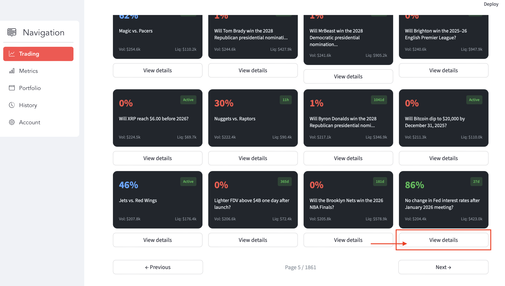

  - Click **View Details** to see full market information:  
    - **Traded volume**, **liquidity**, **end date**  
    - Market description via **Description** button  
    - Price history over the past few days  
    - Last traded price for **Yes** and **No** tokens  
  - Click **Refresh Orderbook** to get real-time data  

Once you have created a portfolio and refresh the orderbook, you can place an order. We will see just bellow how to create a portfolio.

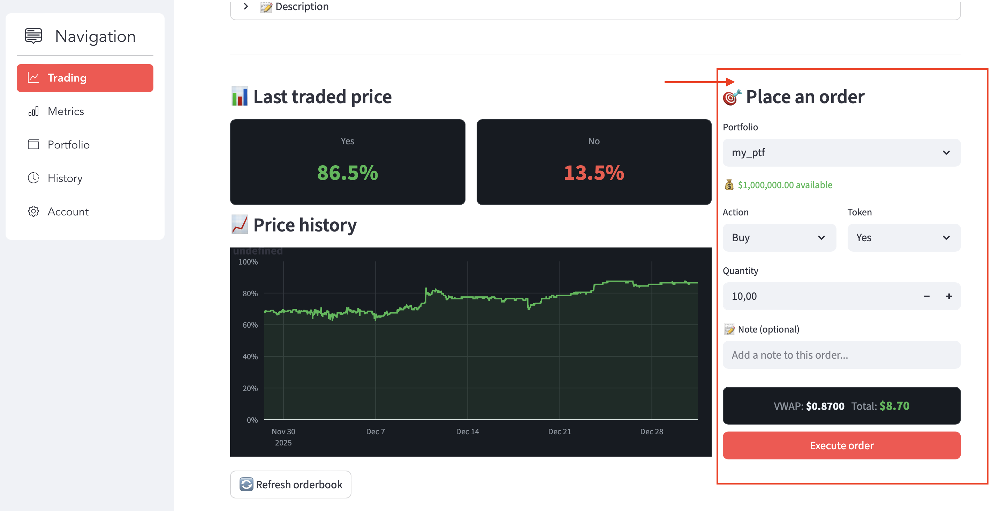

- **Place an Order**:  
  1. Select a **portfolio** (must be created first).  
  2. Choose **Buy** or **Sell**.  
  3. Select the **token** and enter the **quantity**.  
  4. Optionally, add a **note**.  
  5. Click **Execute Order**.  


In order to make a trade, you need first to create a portfolio. Let's see how to create a portfolio.

---

### 2.4. Portfolio Page

- **Create a Portfolio**:  
  - Go to the **Portfolio** page.  
  - Click **Create Portfolio**, enter a **name** and **initial amount**.  
  - Click **Create**.  

Once a portfolio has been created, several buttons allow you to perform actions on it. The **Trading** button takes you directly to the Trading Page to take positions on markets using this portfolio. The **Metrics** button opens the Metrics Page (described below) to view the performance of this portfolio. You can also view the **Details** of the portfolio or **Delete** the portfolio entirely.

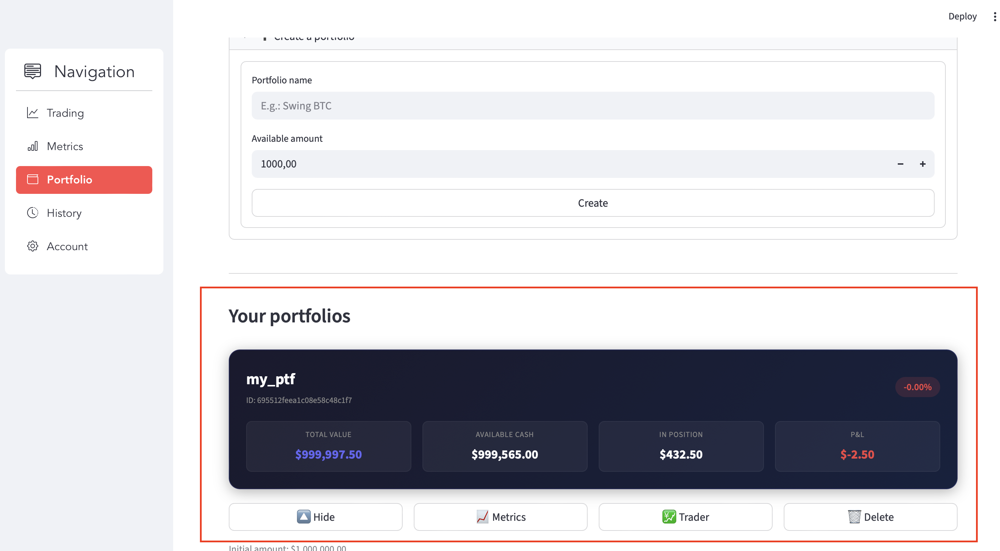

- **View Portfolios and Positions**:  
  - Created portfolios appear below the form, initially empty.  
  - Click **Details** to see position composition and performance.  
  - Available buttons:  
    - **Modify**: Return to Trading page to adjust positions  
    - **Liquidate**: Sell all positions and recover cash  

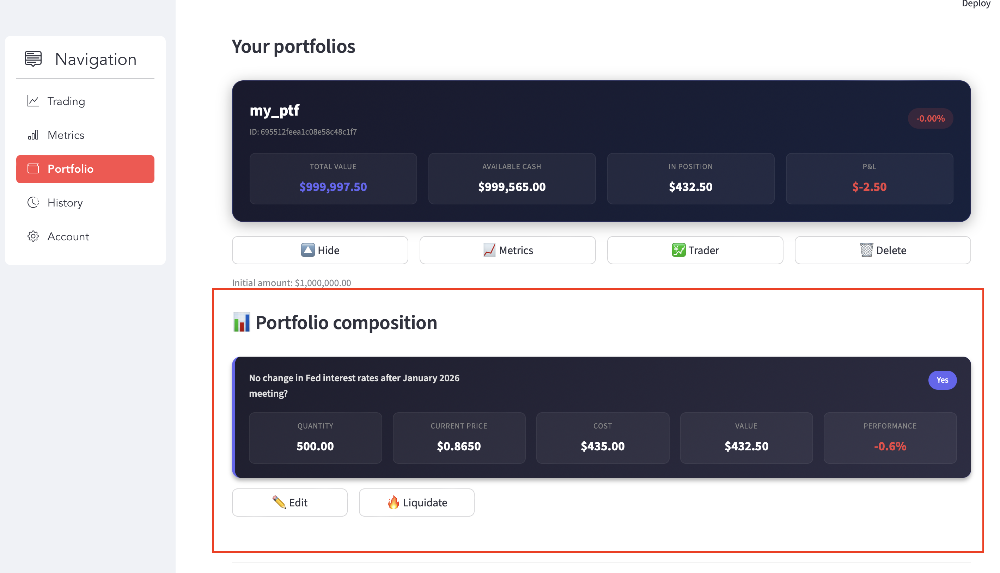

So when a portfolio has been created and when a trade has been down, you can see the performance of your portfolio on the Metrics page.

---

### 2.5. Metrics Page

First you need to select a portfolio. Then, two charts are displayed :

- Displays the **P&L evolution** over time for a portfolio.  

- Filter menu to view **specific position P&L**.  
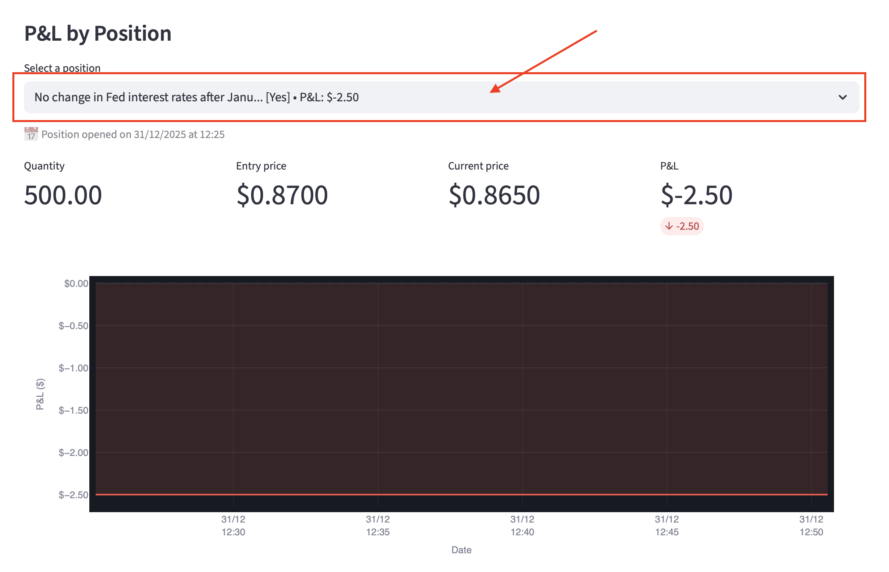
---

### 2.6. History Page

- Shows the history of **all your transactions**: buys, sells, deposits, withdrawals.  
- Filter by portfolio or transaction type.  
- Download history as **CSV** for external analysis.  
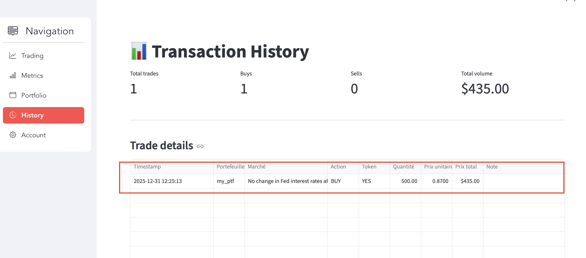

---

### 2.7. Account Page

- Update personal information: you can change your password.
- **Log out** securely from the application.  

---

## 3. How the App Works

### Backend (FastAPI)

#### Authentication

The backend uses JWT-based authentication with the following characteristics:

| Setting | Value |
|---------|-------|
| Password hashing | bcrypt (via `passlib`) |
| Token algorithm | HS256 |
| Token expiry | **30 minutes** (configurable via `ACCESS_TOKEN_EXPIRE_MINUTES`) |
| Token delivery | Query parameter (`?token=xxx`) — required for Streamlit compatibility |

**Protected endpoints** extract the token from the query string, decode it, and verify the user exists and is active. User roles (`user`, `premium_user`, `admin`) enable role-based access control.

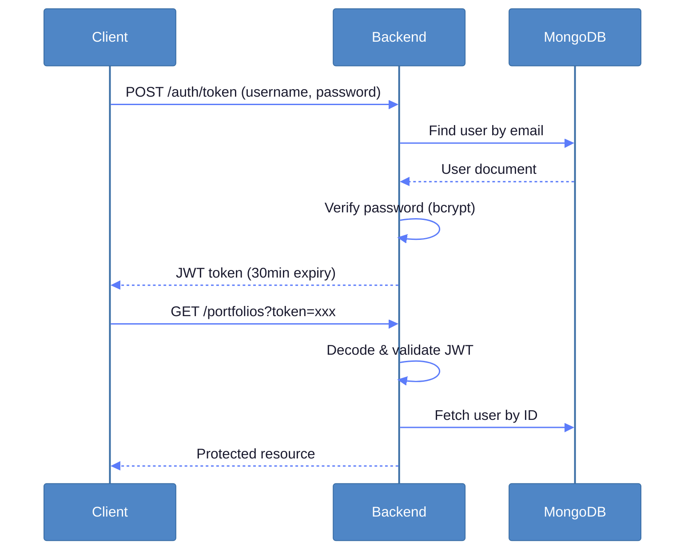

#### Data Validation

All API requests and responses are validated using Pydantic schemas:

- **Models** (`backend/app/models/`): Define MongoDB document structure (User, Portfolio, Trade, MarketMetadata)
- **Schemas** (`backend/app/schemas/`): Define API request/response shapes with validation rules

New portfolios start with a default balance of **$10,000**.

#### Database Architecture

MongoDB is organized into four separate databases for logical separation:

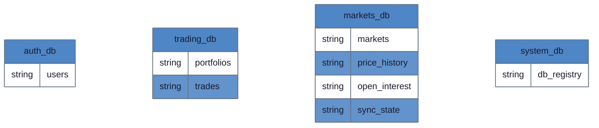

| Database | Purpose | Key Indexes |
|----------|---------|-------------|
| `auth_db` | User authentication | Unique on `email` |
| `trading_db` | Portfolios and trade history | `user_id`, compound on `portfolio_id + timestamp` |
| `markets_db` | Polymarket data cache | Unique on `condition_id` and `slug`, text index on `question` |
| `system_db` | Cross-database registry | — |

#### Polymarket API Integration

Three public APIs are used (no authentication required):

| API | Base URL | Data Fetched |
|-----|----------|--------------|
| Gamma | `https://gamma-api.polymarket.com` | Market metadata (question, outcomes, volume) |
| CLOB | `https://clob.polymarket.com` | Price history, live orderbook |
| Data | `https://data-api.polymarket.com` | Open interest, holder counts |

**Lazy loading strategy**: Market data is fetched on-demand. When a user requests a market not in the cache, `MarketService` fetches it from Polymarket, stores it in MongoDB, and returns it. The sync worker keeps the cache fresh in the background. 
This was an early implementation choice to avoid calling excessively on Polymarket's API and only retrieving what was needed, and this way, information from Polmarket is fetched once for all users.

Full API documentation is available at [http://localhost:8000/docs](http://localhost:8000/docs) when the backend is running.

---

### Workers

#### polymarket_sync

Periodically fetches market metadata from Polymarket and stores it in MongoDB.

| Setting | Value |
|---------|-------|
| Batch size | 500 markets per API request |
| Incremental sync | Every **5 minutes** (active markets only) |
| Full sync | Every **24 hours** |
| Progress tracking | `sync_state` collection (resumable) |

The worker transforms raw API responses (parsing JSON strings, converting types) and performs bulk upserts. Each batch is saved immediately, so a full sync can be interrupted and resumed.

#### live_data_worker

Streams real-time orderbook data from Polymarket's CLOB WebSocket to Redis.

| Setting | Value |
|---------|-------|
| WebSocket URL | `wss://ws-subscriptions-clob.polymarket.com/ws/market` |
| Redis stream | `polymarket:orderbook_stream` (capped at 10,000 messages) |
| Control channel | `live-data-control` (pub/sub for start/stop commands) |

The worker maintains a live orderbook snapshot in Redis, accessible via the `/market-stream/orderbook` REST endpoint.


---

## 4. Implementation Notes & Deployment TODOs

### Critical: Rate Limiting Not Implemented

The rate limiting module ([backend/app/core/rate_limit.py](backend/app/core/rate_limit.py)) contains **placeholder functions that always return `True`**. Before deployment:

- Implement sliding window rate limiting using Redis
- Enforce configured limits:
  - Login: 5 attempts / 60 seconds per IP
  - Registration: 10 attempts / 60 seconds per IP
  - Global: 100 requests / minute
- Implement account lockout after 10 failed login attempts (30-minute lockout)

### Streamlit WebSocket Limitation

Streamlit does not handle async WebSocket connections well. As a workaround:

- The backend exposes `/market-stream/orderbook` as a REST endpoint
- The frontend polls this endpoint instead of maintaining a WebSocket connection
- The WebSocket endpoint (`/ws/live`) exists but is primarily a placeholder

For a production frontend, consider migrating to React or another framework that supports WebSocket connections natively. We actually hesitated to use React at first, but a 10/10 security vulnerability was just found at the time, and Streamlit was a simpler, faster, and still decent solution.

### CORS Configuration for Deployment

For server deployment, update the CORS whitelist in [backend/app/main.py](backend/app/main.py#L84):

```python
allow_origins=[
    "http://localhost:8501",
    "http://your-server-ip:8501",  # Add your server
]
```

### Test Coverage Gaps

Current tests cover basic functionality (health checks, service methods, formatters). Additional tests needed:

- Edge cases: market state transitions (active → closed)
- Trade execution edge cases (insufficient balance, market closed)
- Concurrent request handling
- Worker failure recovery

See [tests/TESTING.md](tests/TESTING.md) for current test structure and rationale.

### Other Notes

- CLOB API returns an empty array for markets with no trade history
- The `JWT_SECRET_KEY` in `.env` must be changed for production
- MongoDB has no authentication configured (add credentials for production)

---

## License

MIT License